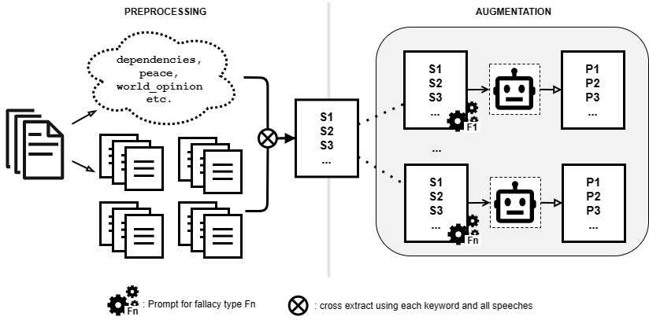

This project is an enhancement to the task of logical fallacy detection by offering a richer benchmark dataset named [**LOGICPOLITICS**](Data/Premises/logicpolitics_filtered.csv), as an extension to **LOGIC** and **LOGICCLIMATE** datasets from the [Logical Fallacy Detection paper](https://arxiv.org/abs/2202.13758). The dataset is created by using a pipeline for mining fallacies from raw political speeches, leveraging the power of Large Language Models in dataset augmentation.

## The pipeline
The data processing and augmentation pipeline for creating **LOGICPOLITICS** is shown in the above figure. To the left is the preprocessing component, where we, from the source of political speeches, generate speech summarization and a list of the most prevalent keywords. Keywords and summarizations will then be used to extract sentences `S = {S1, S2, ...}` that serve as good input for the data augmentation step. To the right, we briefly visualize the workflow of data augmentation. For the same set of extracted sentences `S`, we use an LLM to create a corresponding set of premises (fallacious sentences) `P = {P1, P2, ...}` under the fallacy category of `Fi`.

## Results
Our final dataset of **LOGICPOLITICS** comprises 12,489 premises across four types of fallacies (*Appeal to Emotion, False Dilemma, Fallacy of Relevance, Intentional Fallacy*).

Evaluation on **LOGICPOLITICS** showed fair results, signifying a potential enhancement to the fallacy detection benchmark. Electra fine-tuned on LOGICPOLITICS performs `2%` worse than Electra-Logic in terms of accuracy:

| Model                     | F1   | P    | R    | Acc  |
|---------------------------|------|------|------|------|
| Electra-Logic             | 0.68 | 0.59 | 0.76 | 0.42 |
| Electra-LogicPolitics     | 0.66 | 0.54 | 0.67 | 0.40 |

Class-specific performance achieved by Electra-LogicPolitics. For each class, we report the F1 score, precision (P), recall (R), and the frequency (Freq.) of the class in the LOGIC test set:

| Logical Fallacy Class     | P        | R        | F1       | Freq.     |
|-----------------------    |------    |------    |------    |-------    |
| Appeal to Emotion         | 0.57     | 0.34     | 0.43     | 23        |
| False Dilemma             | 0.78     | 0.91     | 0.84     | 12        |
| Intentional Fallacy       |          | 0.66     | 0.37     | 15        |
| Fallacy of Relevance      | 0.94     | 0.66     | 0.78     | 24        |
| **Overall**               | **0.49** | **0.61** | **0.56** | **75**    |

## Conclusion
LOGICPOLITICS dataset still needs further improvement in reducing the repetitiveness of the generated premises. Therefore, we need to polish the prompts for augmentation, by unifying the number of examples in all prompts for all fallacies and providing clearer instructions to avoid repetitiveness.

We hope that our contribution will facilitate the creation of resilient models aimed at combating manipulation.